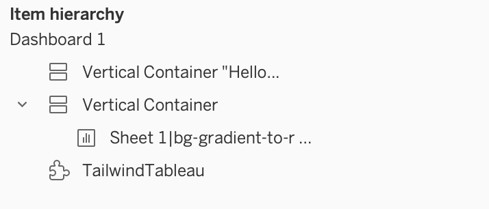

# TailwindTableau

TailwindCSS style extension for Tableau. 

Inspired by and a fork of [TabCSS](https://github.com/FsuLauncherComp/BootstrapTableau)

## Usage

### Basics 

1. Add the extension as floating to your workbook
2. All Tableau objects that should be influenced have to be positioned in front of the extension (you can create one floating container, position it in front of the extension, and put your objects in there)
3. Style your objects by editing their name. Everything behind a bar (|) will be added as tailwind classes to the object example: `KPI Container|rounded-b-lg z-3 shadow-lg bg-gradient-to-b from-slate-100 to-slate-50`

### Adding styled text

You can also add styled text to your objects. Add text within " before the pipe (|) to do this. You can add a second pipe and classes for the text to style the text.
Example: `Vertical Container "Hello World"|bg-slate-500 items-center justify-center w-full h-full flex|text-2xl  text-slate-50`

## Useful Links

[Tailwind Documentation](https://tailwindcss.com/) Here you can find all the available styling options

